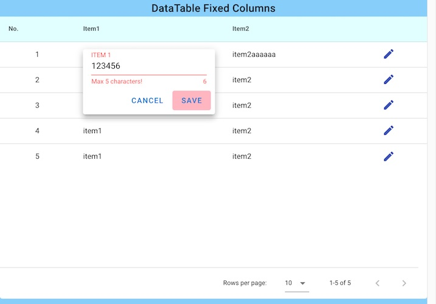

# vuetify_table_editdialog_disable_savebutton

* Disable Save Button on EditDialog by valid state of input rules.
  

1. set :rules to v-text-field.
1. set v-model to v-form.
1. watch valid state of v-form.
1. add or remove "disable" class to save button on active edit dialog.